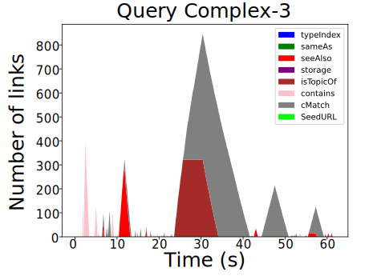
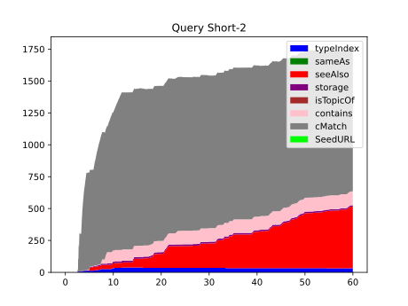
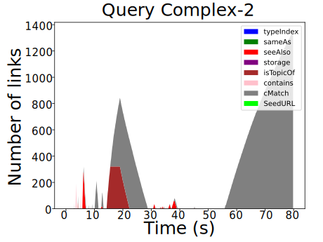

## Results
{:#results}
Font size of the figures needs to be a least times 3 and I am not exaggerating.
Possibly the legend is only needed once; also think about the color blind (AKA those who print in black and white)

First, we will present a selection of the link queue evolutions that accurately represent what we found in all 27 queries. 
<del class="comment" data-author="RV"> has the query execution time on the x-axis and the number of links of a given type on the y-axis. </del>
The axis labels should be on the figure (with font size times 3).
We run the queries using the default Solid configuration of Comunica  and set the timeout at 60 seconds.
What is the sampling frequency of the link queue? Or are the numbers instantaneous?

From these figures, we find two categories of queries: queries where the engine can quickly process the number of discovered links and queries where the number of links followed increases steadily to the point that the query engine cannot handle the number of discovered links. 
Furthermore, we set the timeout to 1100 seconds for  to investigate the spike of <em class="keyword">cMatch</em> links. 
The result is given in .
We find that the <em class="keyword">cMatch</em> criterion can quickly generate a very large number of links to follow, slowing down the query execution and making the query infeasible to execute.

<figure id="figure-main" class="result-figure-grid ">
<figure id="figure-main-1" class="subfigure">

<figcaption markdown="block">
Link queue content of the complex-3 query. 
Try saying not what we see, but what we are _supposed_ to see. Example: <q><em class="keyword">cMatch</em> strains the link queue more than all others, because…</q>
</figcaption>
</figure>

<figure id="figure-main-2" class="subfigure">

<figcaption markdown="block">
Link queue content of the discover-7 query. 
</figcaption>
</figure>

<figure id="figure-main-3" class="subfigure">

<figcaption markdown="block">
Link queue content of the short-2 Query. 
</figcaption>
</figure>

<figure id="figure-main-4" class="subfigure">

<figcaption markdown="block">
Link queue content of the short-7 query. 
</figcaption>
</figure>
</figure>

<figure id="figure-main" class="result-figure-grid ">
<figure id="figure-main-2-1" class="subfigure">

<figcaption markdown="block">
Link queue content of the complex-2 query.
</figcaption>
</figure>
<figure id="figure-main-2-2" class="subfigure">

<figcaption markdown="block">
Link queue content of the complex-2 query with an extended timeout. 
</figcaption>
</figure>
</figure>

We investigate the metrics introduced in  to quantify the two query categories.
We split the queries into two groups:
one with a non-zero number of links in the queue for more than 50% of the query execution time,
and the other for less than 50%. 
The group with high queue occupancy contains twelve queries, while the other group contains fifteen queries.
The average metrics of the groups are shown in . 

<figure id="tab:metrics" class="table" markdown="1">

| Query Category | %cMatch | %Contains |pEff(2) | pEff(1) | $$\bar{n^{q}}(0)$$ | $$\bar{n^{q}}(1)$$ |
|---|---|---|---|---|---|---|
| High Queue Occupancy | 0.535 | 0.265 | 0.447 | 0.815 | 2.14 | 2.445 |
| Low Queue Occupancy | 0.290 | 0.423 | 0.019 | 0.118 | 0.137 | 1.134 |

<figcaption markdown="block">
This table shows the average metrics for queries with over and under 50% link queue occupancy. Here **%cMatch** denotes the percentage of links with <em class="keyword">cMatch</em> as the source, **%Contains** for links with Contains predicates as the source. **pEff(k)** denotes the percentage of time the queue has $$k$$ or more links in it. Finally, **$$\bar{n^{q}}(k)$$** the average number of links in the queue when at least $$k$$ links are in the queue. 
</figcaption>
</figure>

## Discussion
{:#Discussion}

<del class="comment" data-author="RV">
As mentioned, we can visually divide queries into two subgroups. 
Queries for which the link queue is mainly empty and the query planning forms the bottleneck, and queries where the link queue fills up rapidly and the query engine cannot dereference the links quickly enough.
The metrics in  support our visual distinction.
</del>
We're just repeating ourselves here.
By dividing the queries based on the percentage of time the link queue has at least one entry, we find a clear difference in link queue characteristics. 
We observe that queries with high queue occupancy have a higher percentage of <em class="keyword">cMatch</em> links and, on average, have more than one type of link in the queue for 50% of the query execution time. 
On the other hand, queries with low queue occupancy have a higher occurrence rate of *contains* links and seldom have more than two types of links in the queue at a given time.

The queries where the link queue is empty for most of the query execution time support the conclusion of , 
namely that current query plan optimization approaches perform poorly for LTQP.
When the link queue is empty, but the query times out, we know that the execution of the query over the retrieved data causes the time out and not dereferencing discovered URIs.

For queries with many links in the queue, we find that the queue often contains different types of links during query execution. 
Do we disagree there then with ? If yes, then make it explicit. (If no, then the previous mention of  might be confusing.)
This indicates that link prioritisation strategies based on link sources can influence query execution strategy during LTQP.
Furthermore, for queries with many links to follow, the query engine discovers most links using the <em class="keyword">cMatch</em> criterion. 
The engine primarily uses <em class="keyword">cMatch</em> to traverse to other Solid pods since all data in a single pod can be retrieved using the contains, storage, and type index predicate links. Queries for which the link queue fills up with thousands of <em class="keyword">cMatch</em>-sourced links show that this method of pod discovery is not sufficiently selective. 
Move to conclusion:
We must find a more selective approach to discover other pods that does not produce the gigantic amount of followable links that <em class="keyword">cMatch</em> does. 
