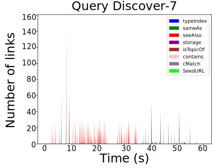
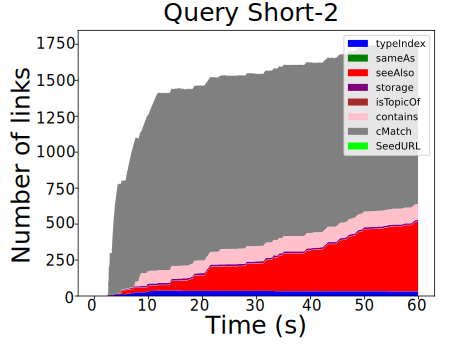
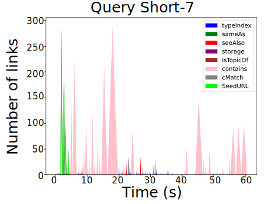

## Results
{:#results}
In , we present a selection of the link queue evolutions that accurately represent what we found in all 27 queries. 
From these figures, we find two categories of queries: queries where the engine can quickly process the number of discovered links and queries where the number of links followed increases steadily to the point that the query engine cannot handle the number of discovered links. 
Furthermore, we set the timeout to 1,100 seconds for  in order to investigate the spike of <em class="keyword">cMatch</em> links. 
The result is given in .
We find that the <em class="keyword">cMatch</em> criterion can quickly generate a large number of links to follow, slowing down the query execution and making the query infeasible to execute.

<figure id="tab:metrics" class="table" markdown="1">

| Query Category | %cMatch | %Contains |pEff(2) | pEff(1) | $$\bar{n^{q}}(0)$$ | $$\bar{n^{q}}(1)$$ |
|---|---|---|---|---|---|---|
| High Queue Occupancy | 0.535 | 0.265 | 0.447 | 0.815 | 2.14 | 2.445 |
| Low Queue Occupancy | 0.290 | 0.423 | 0.019 | 0.118 | 0.137 | 1.134 |

<figcaption markdown="block">
This table shows the average metrics for queries with over and under 50% link queue occupancy. Here **%cMatch** denotes the percentage of links with <em class="keyword">cMatch</em> as the source and **%Contains** the percentage of links with the Contains predicate as the source. **pEff(k)** denotes the percentage of time the queue has $$k$$ or more links in it. Finally, **$$\bar{n^{q}}(k)$$** the average number of links in the queue when at least $$k$$ links are in the queue. 
</figcaption>
</figure>

<figure id="figure-main" class="result-figure-grid ">

<figure id="figure-main-1" class="subfigure">

<figcaption markdown="block">
While the query engine manages to fill the link queue, <em class="keyword">cMatch</em> strains the link queue more than others. 
</figcaption>
</figure>

<figure id="figure-main-2" class="subfigure">

<figcaption markdown="block">
The link queue is primarily empty, but the query times out. The empty link queue shows that current query execution plans are insufficiently optimized. 
</figcaption>
</figure>

<figure id="figure-main-3" class="subfigure">

<figcaption markdown="block">
The link queue quickly fills up with many <em class="keyword">cMatch</em> links, and the query engine cannot process the volume of links. 
</figcaption>
</figure>

<figure id="figure-main-4" class="subfigure">

<figcaption markdown="block">
The link queue is primarily empty, but the query times out. The empty link queue shows that current query execution plans are insufficiently optimized. 
</figcaption>
</figure>
</figure>
<figure id="figure-main" class="result-figure-grid ">

<figure id="figure-main-2-1" class="subfigure">

<figcaption markdown="block">
Before the timeout, we see a spike in <em class="keyword">cMatch</em> links, but the query engine can process the links before this.
</figcaption>
</figure>

<figure id="figure-main-2-2" class="subfigure">

<figcaption markdown="block">
When we extend the timeout we find the number of <em class="keyword">cMatch</em> links explodes, making query execution infeasible.
</figcaption>
</figure>
</figure>

We investigate the metrics introduced in  to quantify the two query categories.
We split the queries into two groups:
one with a non-zero number of links in the queue for more than 50% of the query execution time,
and the other for less than 50%. 
The group with high queue occupancy contains twelve queries, while the other group contains fifteen queries. Interestingly, all discover queries belong to the query group with low queue occupancy.
The average metrics of the groups are shown in .

## Discussion
{:#Discussion}

By dividing the queries based on the percentage of time the link queue has at least one entry, we find a clear difference in link queue characteristics. 
We observe that queries with high queue occupancy have a higher percentage of <em class="keyword">cMatch</em> links and, on average, have more than one type of link in the queue for 50% of the query execution time. 
On the other hand, queries with low queue occupancy have a higher occurrence rate of *contains* links and seldom have more than two types of links in the queue at a given time.

The queries where the link queue is empty for most of the query execution time support the conclusion of previous work that current query plan optimization approaches perform poorly for LTQP . The authors support their argument using an empirical experiment on all discover queries; our results find that these queries all have low queue occupancy.
When the link queue is empty, but the query times out, we know that the execution of the query plan over the retrieved data causes the time out and not dereferencing discovered URIs.

For queries with many links in the queue, we find that the link queue often contains different types of links during query execution. 
This diversity of links indicates that link prioritization strategies based on link sources can influence query execution strategy during LTQP.
Furthermore, for queries with many links to follow, the query engine discovers most links using the <em class="keyword">cMatch</em> criterion. 
The engine primarily uses <em class="keyword">cMatch</em> to traverse to other Solid pods since all data in a single pod can be retrieved using the contains, storage, and type index predicate links .
Queries for which the link queue fills up with thousands of <em class="keyword">cMatch</em>-sourced links show that this method of pod discovery is not sufficiently selective. 
While queries with low queue occupancy support the conclusion of , our findings for queries with high queue occupancy contradict it. 
This contradiction is due to the authors of  only using discovery queries in the empirical experiment to support the statement, which all have low queue occupancy. 
